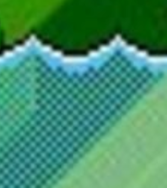

# Game Mechanics
- Final Boss big foot
- Mushroom main character
- Dodge falling pesticide bottles
- Spores give HP
- Hydration metre that you have to fill up
- You start the game with a little animation of you coming out of the ground (but the level they're in is underground, "Undertale" style)

# Main Character
Name: Mustafa Mushroom

It's a mushroom person trying to reach the surface.

# Water Design
We can render the water like this so that it has transparency when you go into it.

